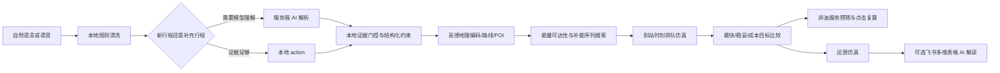

# FlowTwin 算法与数据边界

这份文档用于评委追问时说明：哪些数据来自高德，哪些是 FlowTwin 的演示输入，哪些算法已经实际运行，哪些仍然是后续研发方向。

## 1. 数据分层

| 层级 | 当前内容 | 是否真实 | 处理方式 |
| --- | --- | --- | --- |
| 地图与地理 | 地图底图、地理编码、地点候选、驾车路线、沿线 POI | 高德接口返回的真实结果 | 服务端代理、文件缓存、错误时不伪造路线 |
| 天气 | 起点区县实况天气 | 高德天气接口返回的真实结果 | 作为仿真场景因子；缓存过期时明确标注 |
| 站点运营 | 占用率、容量、服务率、价格、优惠、枪口状态、排队车辆 | FlowTwin 演示仿真 | 固定规则生成或由页面/飞书字段输入；不代表能链实时数据 |
| 排队预测 | P50/P90、预计到站排队 | FlowTwin 演示仿真 | 由预计到站时刻和仿真输入计算；不含补能服务时长 |
| 运营效果 | 预计分流、排队变化、ROI | 场景估算 | 由后端公式计算，不能直接当作实际经营结果 |
| 验证数据 | 30 个合成节点、1,000 次固定种子行程 | 合成数据 | 用于复现策略差异，不用于证明企业 KPI |
| 视觉 | 内置样例/上传图片或短视频的车牌 OCR；车辆、车位、到站识别、模拟收据 | 内置图片是 AI 生成模拟画面；OCR 在本地 PaddleOCR 服务可用时真实执行，其余链路未执行 | 识别失败显示“未识别”，未启用服务显示“未执行”，不执行真实扣款 |

## 2. 端到端调用流



AI 只负责理解输入或解释已有结果；它不接管路线、能量安全和 ROI 计算。

## 3. 能量与补能规划

核心实现位于 `lib/energy.mjs`、`lib/longtrip.mjs`，浏览器状态与展示逻辑在 `app.js`。

### 3.1 演示车辆口径

| 类型 | 消耗模型 | 满量参考续航 | 安全下限 |
| --- | ---: | ---: | ---: |
| 纯电 | 0.18 kWh/km，容量 108 kWh | 600 km | 2% |
| 燃油 | 0.075 L/km，容量 55 L | 约 733 km | 3% |
| 混动电分支 | 0.165 kWh/km，容量 20 kWh | 约 121 km | 2% |
| 混动油分支 | 0.056 L/km，容量 60 L | 约 1,071 km | 3% |
| 混动展示口径 | 两个分支分别规划和比较 | 综合指导值 1,200 km | 仍按分支安全约束 |

这些参数是演示车辆模型，不是某个具体车型的官方参数。用户不填写到达余量时，个人硬约束为空，但物理安全下限仍保留；用户填写的到达余量会覆盖个人目标，不会取消安全下限。

### 3.2 可达性判断

对每一段路线估算：

```text
本段消耗 = 本段距离 × 车辆单位距离消耗
安全可达 = 到站剩余能量 >= 车辆安全下限
终点可行 = 到达终点后剩余能量 >= 用户要求的到达余量（若填写）
```

因此：

- 100% 电量且可以在安全下限以上直达时，不强制插入充电站；
- 5% 电量时，第一站必须先通过安全可达判断，不能沿用满电时的固定站点；
- 到达余量留空不等于余量为 0；
- 到达要求不是强制字段，只有用户表达了时间或余量要求才加入相应约束。

### 3.3 长途搜索边界

`buildLongTripPlans()` 的当前边界：

- 普通路线最多 6 次补能；
- 能量和距离达到极端长途条件时启用 `adaptiveMaxStops`，最多 12 次；
- 自适应候选池最多 72 个站点，序列评估预算最多 12,000 次；
- 站点先按稳定 ID、名称/坐标/进度去重；
- 预算耗尽返回 `SEARCH_BUDGET_EXHAUSTED` / `sequenceSearchComplete: false`，不能把搜索没做完解释成“证明不可达”；
- 高德候选不足时，UI 必须把降级候选标成“演示、待二次核验”。

六次和十二次是计算保护，不是车辆物理上限。未来若放宽，应该增加缓存、候选分层和取消过期请求，而不是直接放开无限枚举。

## 4. 等待预测

### 4.1 两种模型

1. **端口级离散事件仿真**：只有在端口字段明确存在时启用。它会安排当前排队车辆、已有充电中的端口释放时间，以及预计到站前新增车辆。
2. **聚合流量仿真**：缺少端口状态时使用站点容量、占用、到达率、服务率、基础等待和场景因子估算。

预测点按车辆真正预计到站的时间选择，而不是固定取当前站点的第一个预测值。

### 4.2 P50/P90 同源口径

```js
p50 = wait * 0.82
p90 = wait * 1.65 + 3
```

代码中的常量是 `WAIT_P50_FACTOR`、`WAIT_P90_FACTOR`、`WAIT_P90_OFFSET`。运营模块反向使用同一关系从 P90 还原 wait，避免路线页和运营页各算一套。

这里的 `wait/p50/p90` 专门表示排队，不把充电或加油服务时间塞进等待字段。路线账本另行计算：

```text
补能停靠总耗时 = 排队 P50/P90 + 补能服务时长 + 支付驶离缓冲
路线 ETA = 高德驾驶时间 + 补能停靠总耗时
```

当前地图输入没有支付/驶离事件时间，默认使用演示缓冲（燃油 3 分钟、充电 5 分钟）；站点适配器可以用明确字段覆盖，页面不得把它写成企业真实观测值。

### 4.3 置信度含义

`deriveForecastConfidence()` 输出 `confidenceScore`、`confidenceLevel`、`confidenceLabel` 和 `confidenceReasons`。分数反映当前仿真证据是否充分，主要看：

- 是否有端口级输入；
- 端口字段完整度；
- 数据快照新鲜度；
- 预计到站时间是否在预测窗口内；
- 是否有时段、交通、天气因子；
- 是否依赖演示默认字段。

兼容字段 `confidence: "simulation-only"` 仍保留。这个分数不是经过真实标签校准的预测准确率，评委模式中必须同时显示数据边界。

## 5. 三种目标如何比较

每条可行序列都会计算：

```text
totalTime = 驾驶时间 + 排队 + 补能服务时间 + 支付驶离缓冲
totalCost = 补能成本 + roadTolls + serviceCost
reliability = 到站安全余量、排队风险、绕行和搜索完整性的综合排序项
```

“最快”优先总时间；“最稳妥”优先安全余量、低排队风险和较低绕行；“最低成本”使用 `totalCost`，当真实路费/价格不可得时仍标注为演示场景成本。若三种目标选中同一条停靠序列，系统合并为一张方案并给它多个目标标签，不制造重复卡片。

## 6. 规则与大模型的安全边界

- 本地规则先识别明确的新目的地、能源类型、服务关键词和硬约束；
- 多轮补充会保留已有具体地点，不允许模型把“吃饭”擅自变成某个具体商家；
- 模型 action 只有在用户文本存在相应证据时才接受；
- 模型调用失败时走本地降级，并在 UI 中说明解析状态；
- 模型不能写入路线、排队/停靠耗时、ROI 或企业真实数据字段。

这套设计优先保证“不能规划”时说清楚原因，而不是为了让界面看起来完整而编造结果。

## 7. 已接入与尚未具备的数据和能力

当前 Demo 已接入一份冻结的企业需求先验产物：按站点坐标匹配最近企业样本城市，再按油/电类型和到站小时得到需求倍率；它只调整 FlowTwin 的仿真到达强度，不覆盖高德 POI 的名称、价格、枪口状态或站点实时等待。模型版本、留出 WAPE、匹配城市和距离会进入评委模式的预测依据；产物缺失或无法匹配时自动回退到原演示仿真。

以下内容仍没有接入主 Demo：企业真实枪口状态流、真实价格与券库存、强化学习策略、车辆/车位检测、真实摄像头流、车牌留存和支付扣款。企业 `station_id` 与高德 POI 没有可验证的一对一映射，因此不能把企业先验称为某个具体站点的实时经营预测。获得更完整授权数据后，仍需先建立字段映射、数据脱敏和时间切分验证，再扩大接入范围。
